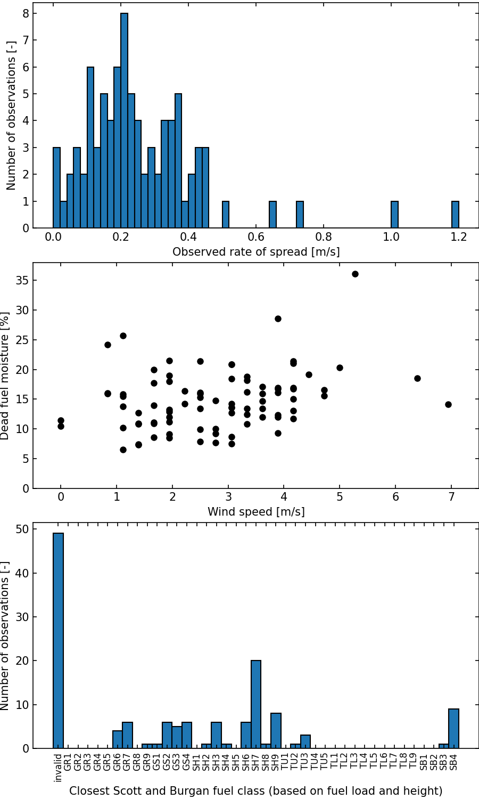

# ROS validation using Anderson 2015 dataset

## Contributors
- Aurélien Costes, [Wildfire Interdisciplinary Research Center](https://www.wildfirecenter.org/), San Jose State University, [aurelien.costes@sjsu.edu](mailto:aurelien.costes@sjsu.edu), [ORCID](https://orcid.org/0000-0003-4543-5107)


## Tags


## Description
The goal is to assess the accuracy of various rate of spread (ROS) models by comparing their computed ROS values against observed data from the Anderson 2015 dataset.
The dataset presented in [1] compiles shrubland fire behavior data from experimental studies conducted across Australia, New Zealand, Europe, and South Africa. It encompasses a wide range of heathland and shrubland vegetation types and structures.  The dataset contains independent data from prescribed fires and wildfires.
The accuracy is evaluated using RMSE, Pearson correlation and NMSE.

## Data description
### Input
- The rate of spread observations are stored in the Table A1 from the [Anderson 2015 dataset](../../../../dataset_experiments/Anderson_2015_dataset.md).
- The data required to run the rate of spread model is also contained in the Table A1 from the [Anderson 2015 dataset](../../../../dataset_experiments/Anderson_2015_dataset.md)
- If some required inputs are not available in the provided dataset, it is allowed to add complementary data from the [Scott and Burgan 40 fuel models](../../../../fire_models_info/21_fuel_models/03_SB40.md). If the required data is not present in Scott and Burgan fuel model, it is allowed to use [Anderson](../../../../fire_models_info/21_fuel_models/02_Anderson.md) fuel model.

All of the data mentionned above is available within the package `FireBench`.

The following plot presents some statistics about the Anderson 2015 dataset.
The top panel shows the distribution of the rate of spread for valid observations (where the input data are complete to run a rate of spread model).
The middle panel shows the observation in a wind/fuel moisture space.
The bottom panel shows the distribution of the closest Scott and Burgan fuel catgeory based on fuel load and fuel height. The invalid category groups the observations where the fuel load or fuel heught information is not available.


### Expected output data
- The workflow generates an output file in [hdf5 format](https://www.hdfgroup.org/solutions/hdf5/). The output file contains the expected and computed rate of spread.

## Initial conditions and configuration
- To add complementary data from Scott and Burgan fuel model, you need to select the category that represents at best the fuel from the Anderson 2015 dataset. To select which fuel category to use, employ the `firebench.tools.find_closest_fuel_class_by_properties` function to identify the nearest fuel category. In this benchmark, use `FUEL_LOAD_DRY_TOTAL` and `FUEL_HEIGHT`, and apply default weights to determine similarity.
- Apply the `Baughman_generalized_wind_reduction_factor_unsheltered` method to compute the wind reduction factor, considering that the input wind measurements are taken above the vegetation canopy. 

## Metrics definition
The accuracy of the rate of spread model is evaluated using:
- RMSE using `firebench.metrics.stats.rmse`.
- NMSE with range normalization using `firebench.metrics.stats.nmse_range`.
- Pearson correlation coefficient using `numpy.corrcoef`.

## Current Benchmark results

The following table summarize the results for different rate of spread models, and sort them by RMSE value.

Model                  | Benchmark status  | RMSE [m/s]     | NMSE [-]      | Pearson correlation [-]
---------------------- | ----------------- | -------- | --------- | -------------------
Balbi_2022        |  | 0.67 | 0.56 | 0.53
Rothermel_SFIRE        |  | 1.40 | 1.17 | 0.43

More information about benchmark results:
```{toctree}
:maxdepth: 1

report_Rothermel_SFIRE.md
report_balbi_2022.md
```

## Publication status
- The dataset for this benchmark is described in [1].

## Licensing and Use Terms
As the data provided is prior to January 1st, 2024, the commercial use of this data requires explicit permission from the publisher. For more detailed information or to seek permissions, you can visit the [CSIRO Publishing Open Access page](https://www.publish.csiro.au/wf/forauthors/openaccess).

## Additional notes
- The worklow template can be found at `firebench/workflow/rate_of_spread_models_analysis/01_01_Anderson_2015_validation`.
- If you don't find the content in the `data` directory, try `git lfs pull`.

## Reference

[1] [Anderson, W. R., Cruz, M. G., Fernandes, P. M., McCaw, L., Vega, J. A., Bradstock, R. A., ... & van Wilgen, B. W. (2015). A generic, empirical-based model for predicting rate of fire spread in shrublands. International Journal of Wildland Fire, 24(4), 443-460.](https://doi.org/10.1071/WF14130)

