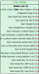

# Anderson 13 fuel model
## Description
The Anderson 13 fuel model, also known as the Albini 13, is a widely recognized system used in wildfire modeling to categorize vegetation types based on their burning characteristics. Developed by Hal Anderson in the 1980s [1], these models classify surface fuels into 13 groups based on parameters such as fuel load, moisture content, and expected fire behavior. Each fuel model provides an idealized description of vegetation structure, from fine grasses and brush to timber and logging slash, enabling prediction of flame length, fire spread rate, and intensity under given environmental conditions. 

## Firebench dataset content

Variable name in dataset    | Unit  | Standard Variable Name    | type      | Source
------------------------    | ----  | ----------------------    | ----      | ------
fcwh                        | m     | fuel_wind_height          | float64   | [2]
fcz0                        | m     | fuel_roughness_height     | float64   | [2]
ffw                         | -     | fuel_fraction_consumed_flame_zone | float64 | [2]
fgi                         | kg m-2| fuel_load_dry_total       | float64   | [1]
fuel_name                   |       |                           | object    | [1]
fueldens                    | lb ft-3| fuel_density             | float64   | [2]
fueldepthm                  | m     | fuel_height               | float64   | [1]
fuelmce                     | %     | fuel_moisture_extinction  | float64   | [1]
ichap                       | -     | fuel_chaparral_flag       | int32     | [2]
k_tc                        | W m-1 K-1| fuel_thermal_conductivity| float64 | [2]
savr                        | ft-1  | fuel_surface_area_volume_ratio| float64 | [2]
se                          | -  | fuel_mineral_content_effective| float64  | [2]
st                          | -  | fuel_mineral_content_total   | float64   | [2]
weight                      | -  | fuel_sfireburnup_consumption_cst| float64| [2]
windrf                      | -  | fuel_wind_reduction_factor   | float64   | [3]
fuel_load_1h                | ton acre-1| fuel_load_dry_1h      | float64   | [1]
fuel_load_10h               | ton acre-1| fuel_load_dry_10h     | float64   | [1]
fuel_load_100h              | ton acre-1| fuel_load_dry_100h    | float64   | [1]
fuel_load_live              | ton acre-1| fuel_load_dry_live    | float64   | [1]

## Usage

Import the Anderson fuel model data using `FireBench` with:
```python
import firebench.tools as ft
fuel_data = ft.import_anderson_13_fuel_model()
```
The data is stored in the dictionnary `fuel_data`. The keys are the standard variable names and the values are numpy array associated with pint unit.



## Compatibility with fire models

Compatibility levels:
- **Full**: The data contained in the fuel model covers *all* the fuel input needed by the fire model
- **Partial**: The data contained in the fuel model covers *some* of the fuel input needed by the fire model
- **None**: The data contained in the fuel model covers *none* of the fuel input needed by the fire model


Fire model              | Category          | Compatibility level
----------              | --------          | -----------------
Rothermel_SFIRE         | ROS vegetation    | Full
Balbi_2022_fixed_SFIRE  | ROS vegetation    | Full
Hamada_1                | ROS urban         | None
Hamada_2                | ROS urban         | None


## References

[1] [Anderson, H. E. (1982). Aids to determining fuel models for estimating fire behavior. USDA Forest Service google schola, 2, 3820-3824.](https://www.fs.usda.gov/rm/pubs_int/int_gtr122.pdf)

[2] WRF-SFIRE version W4.4-S0.1

[3] [Baughman, R. G., & Albini, F. A. (1980, April). Estimating midflame windspeeds. In Proceedings, Sixth Conference on Fire and Forest Meteorology, Seattle, WA (pp. 88-92).](https://www.frames.gov/documents/behaveplus/publications/Baughman_and_Albini_1980_EstMidflamWind_ocr.pdf)